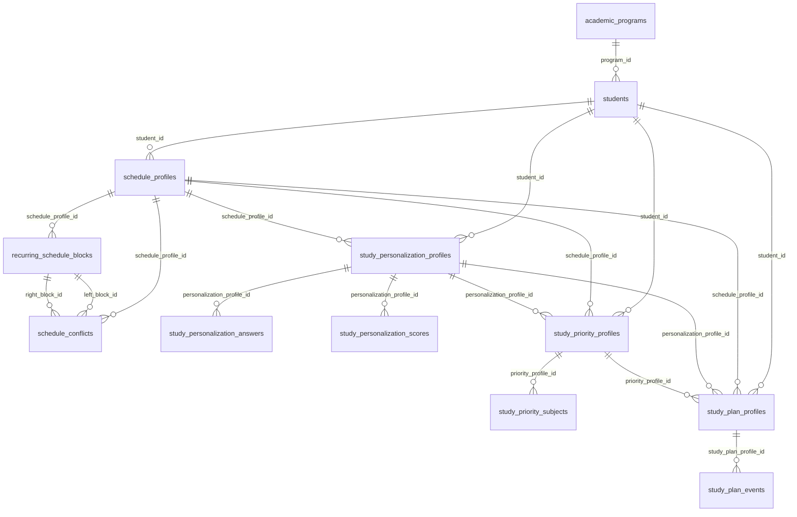

# Informe de base de datos y persistencia del agente academico

Fecha de revision: 2026-04-03

## 1. Objetivo del informe

Este informe documenta:

- como se conecta el agente con PostgreSQL;
- como fluye la persistencia entre el estado del agente y la base de datos;
- que tablas existen hoy en la base real;
- para que sirve cada tabla y cada campo;
- que relaciones existen entre las tablas;
- si la persistencia actual entre agente y BD realmente existe;
- que tan adecuado es el diseno para el MVP actual;
- que mejorarias a corto y mediano plazo.

## 2. Fuentes revisadas

Se revisaron estas capas del proyecto:

- migraciones SQL en `migrations/0001` a `migrations/0008`;
- factories y configuracion de BD en `src/agents/support/tools/db.py` y `src/agents/support/tools/db_config.py`;
- checkpointer de LangGraph en `src/agents/support/tools/langgraph_checkpointer.py`;
- repositorios y servicios de onboarding, scheduling, personalization y planning;
- nodos del grafo que disparan persistencia;
- esquema real de PostgreSQL consultado el 2026-04-03.

## 3. Resumen ejecutivo

### 3.1 Estado general

Si, hoy si existe persistencia real entre el agente y la base de datos relacional.

La arquitectura usa dos capas de persistencia distintas:

1. Persistencia de negocio
   Guarda entidades del dominio academico como estudiantes, horarios, perfil de estudio, prioridades y planes semanales.
2. Persistencia conversacional
   Guarda checkpoints de LangGraph para poder reanudar hilos del agente.

### 3.2 Conclusiones principales

- El proyecto no usa ORM. Usa SQL directo con `psycopg`.
- El estado conversacional del agente y los datos de negocio no son lo mismo ni se guardan en las mismas tablas.
- El modelo relacional esta bien orientado a snapshots versionados por estudiante.
- El modulo de horarios y el de personalizacion ya se ven maduros en datos reales.
- El modulo de planning ya existe y persiste, pero todavia tiene poca adopcion en la base actual.
- El checkpointer de LangGraph esta implementado, pero en la base revisada aun no tiene registros.
- Para el MVP actual, la base esta bien para:
  - gestion de agenda;
  - recomendacion de metodo de estudio;
  - planificacion semanal base;
  - captura de prioridades.
- Para el MVP aun faltan tablas propias si realmente quieres cubrir:
  - recordatorios/seguimiento;
  - replanificacion automatica persistente;
  - historial operativo de cambios del plan.

## 4. Snapshot de la base real revisada

Consulta realizada sobre la base activa el 2026-04-03.

### 4.1 Tablas encontradas en `public`

La base real tiene 15 tablas:

- `academic_programs`
- `students`
- `email_verification_challenges`
- `schedule_profiles`
- `recurring_schedule_blocks`
- `schedule_conflicts`
- `study_personalization_profiles`
- `study_personalization_answers`
- `study_personalization_scores`
- `study_priority_profiles`
- `study_priority_subjects`
- `study_plan_profiles`
- `study_plan_events`
- `langgraph_thread_checkpoints`
- `langgraph_checkpoint_writes`

### 4.2 Conteo de filas actual

| Tabla | Filas |
|---|---:|
| academic_programs | 1 |
| students | 16 |
| email_verification_challenges | 0 |
| schedule_profiles | 24 |
| recurring_schedule_blocks | 357 |
| schedule_conflicts | 13 |
| study_personalization_profiles | 16 |
| study_personalization_answers | 166 |
| study_personalization_scores | 128 |
| study_priority_profiles | 2 |
| study_priority_subjects | 2 |
| study_plan_profiles | 2 |
| study_plan_events | 6 |
| langgraph_thread_checkpoints | 0 |
| langgraph_checkpoint_writes | 0 |

### 4.3 Lectura rapida del estado real

- El modulo de onboarding ya esta en uso porque hay 16 estudiantes.
- El modulo de horarios ya esta en uso porque hay 24 perfiles versionados y 357 bloques.
- El modulo de personalizacion ya esta en uso porque hay 16 perfiles y 166 respuestas.
- El modulo de planning ya esta desplegado, pero aun se ha usado poco porque solo hay 2 snapshots de prioridad y 2 de plan.
- El checkpointer de LangGraph no muestra actividad en esta base. Eso puede significar:
  - que el runtime no se esta ejecutando contra esta misma base;
  - o que los hilos no se han corrido con persistencia activa en este entorno.

## 5. Como se conecta el agente con la base de datos

## 5.1 Conexion de negocio

La conexion principal se resuelve en `src/agents/support/tools/db_config.py`.

La logica es:

1. Si existe `ACADEMIC_AGENT_DATABASE_URL`, se usa esa URL completa.
2. Si no existe, se construye desde `PGHOST`, `PGPORT`, `PGDATABASE`, `PGUSER` y `PGPASSWORD`.
3. Esa URL se entrega a los repositorios PostgreSQL.

Esto significa que la aplicacion puede conectarse sin ORM y sin configuracion adicional aparte de variables de entorno.

## 5.2 Conexion del grafo y del runtime

El entrypoint real no es `main.py`. El runtime real esta en `langgraph.json`.

`langgraph.json` hace tres cosas importantes:

- carga `.env`;
- expone el grafo `support` desde `src/agents/support/agent.py:agent`;
- registra un checkpointer desde `src/agents/support/tools/langgraph_checkpointer.py:create_checkpointer`.

## 5.3 Factory de servicios

`src/agents/support/tools/db.py` funciona como contenedor liviano de servicios singleton.

Desde ahi el agente obtiene:

- `get_onboarding_service()`
- `get_schedule_service()`
- `get_personalization_service()`
- `get_study_planning_persistence_service()`

Cada servicio decide si usa:

- repositorio en memoria para pruebas; o
- repositorio PostgreSQL para persistencia real.

Los flags de in-memory son:

- `ACADEMIC_AGENT_USE_IN_MEMORY_ONBOARDING_REPO`
- `ACADEMIC_AGENT_USE_IN_MEMORY_SCHEDULE_REPO`
- `ACADEMIC_AGENT_USE_IN_MEMORY_PERSONALIZATION_REPO`
- `ACADEMIC_AGENT_USE_IN_MEMORY_STUDY_PLANNING_REPO`

Si esos flags no estan en `1`, el agente usa PostgreSQL.

## 5.4 Driver y estilo de acceso

El acceso a BD se hace con:

- `psycopg.connect(...)`
- `row_factory=dict_row`
- SQL manual con `SELECT`, `INSERT`, `UPDATE`, `DELETE`
- `conn.commit()` explicito

En otras palabras:

- no hay ORM;
- no hay modelos SQLAlchemy;
- no hay repositorio generico;
- la capa de persistencia es simple, directa y facil de rastrear.

## 5.5 Checkpointer de LangGraph

La persistencia de hilos se resuelve aparte, en `src/agents/support/tools/langgraph_checkpointer.py`.

La URL del checkpointer se resuelve asi:

1. `LANGGRAPH_CHECKPOINTER_DATABASE_URL`
2. `POSTGRES_URI`
3. fallback a la misma URL de negocio (`ACADEMIC_AGENT_DATABASE_URL` o `PG*`)

Antes de crear el checkpointer, el codigo valida que existan:

- `langgraph_thread_checkpoints`
- `langgraph_checkpoint_writes`

Si faltan, el runtime falla con un mensaje claro indicando que hay que aplicar la migracion `migrations/0003_langgraph_thread_persistence.sql`.

## 6. Flujo de persistencia entre agente y base de datos

## 6.1 Vista corta del flujo

```text
langgraph.json
  -> grafo support
  -> nodo persist_*
  -> service
  -> repository
  -> psycopg.connect
  -> SQL
  -> commit
  -> el nodo guarda el ID persistido de vuelta en el estado del agente
```

## 6.2 Persistencia de onboarding

Nodo:

- `persist_profile`

Flujo:

1. El nodo toma `student_profile` del estado.
2. Llama `get_onboarding_service().persist_student(profile)`.
3. El servicio valida que el email ya este verificado.
4. El repositorio PostgreSQL inserta en `students`.
5. Si el programa existe en `academic_programs`, guarda su `program_id`.
6. El nodo actualiza el estado con `student_profile.persisted_student_id`.

Persistencia intermedia de verificacion:

- `send_email_verification` y `verify_email_code` usan `email_verification_challenges`.

## 6.3 Persistencia de horario

Nodo:

- `persist_schedule`

Flujo:

1. El nodo toma `student_profile.persisted_student_id`.
2. Toma bloques y conflictos del subestado `schedule`.
3. Llama `get_schedule_service().persist_schedule(...)`.
4. El repositorio:
   - calcula `version_number`;
   - marca el perfil anterior como `is_current = FALSE`;
   - inserta nuevo `schedule_profile`;
   - inserta `recurring_schedule_blocks`;
   - inserta `schedule_conflicts`;
   - hace `commit`.
5. El nodo guarda `schedule.persisted_profile_id`.

## 6.4 Persistencia de personalizacion

Nodo:

- `persist_study_profile`

Flujo:

1. El nodo toma `student_profile.persisted_student_id`.
2. Usa el `schedule.persisted_profile_id` ya guardado.
3. Llama `get_personalization_service().persist_study_profile(...)`.
4. El servicio transforma el resultado del Radar a:
   - un perfil final;
   - respuestas;
   - scores.
5. El repositorio:
   - versiona `study_personalization_profiles`;
   - inserta `study_personalization_answers`;
   - inserta `study_personalization_scores`;
   - hace `commit`.
6. El nodo guarda `study_profile.persisted_profile_id`.

## 6.5 Persistencia de prioridades y plan semanal

Nodos involucrados:

- `persist_study_profile`
- `collect_priorities`
- `build_study_plan`

Capa de integracion:

- `persist_planning_snapshot_for_update(...)`

Flujo:

1. El nodo genera o actualiza `subjects`, `priorities` y `study_plan`.
2. La capa `persist_planning_snapshot_for_update` toma:
   - `student_id`;
   - `schedule_profile_id`;
   - `personalization_profile_id`;
   - `priorities`;
   - `subjects`;
   - `study_plan`.
3. Llama `StudyPlanningPersistenceService.persist_snapshot(...)`.
4. El repositorio PostgreSQL, dentro de una sola transaccion:
   - versiona `study_priority_profiles`;
   - inserta `study_priority_subjects`;
   - versiona `study_plan_profiles`;
   - inserta `study_plan_events`;
   - hace `commit`.
5. La capa de integracion devuelve al estado:
   - `priorities.persisted_profile_id`
   - `priorities.version_number`
   - `study_plan.persisted_profile_id`
   - `study_plan.version_number`

## 6.6 Persistencia de hilos de LangGraph

No la disparan los nodos de negocio directamente.

La dispara el runtime de LangGraph cuando guarda:

- checkpoints del thread;
- writes pendientes entre nodos.

Es decir:

- `students`, `schedule_*`, `study_*` guardan datos de negocio;
- `langgraph_*` guarda la memoria operacional del hilo.

## 6.7 Concluson sobre si existe persistencia entre agente y BD

Si existe, y ademas existe de forma bidireccional en este sentido:

- el agente persiste datos en PostgreSQL;
- PostgreSQL devuelve IDs reales;
- esos IDs vuelven al estado del agente;
- esos IDs se usan para enlazar etapas posteriores.

Los campos puente mas importantes son:

- `student_profile.persisted_student_id`
- `schedule.persisted_profile_id`
- `study_profile.persisted_profile_id`
- `priorities.persisted_profile_id`
- `priorities.version_number`
- `study_plan.persisted_profile_id`
- `study_plan.version_number`

## 7. Relaciones entre tablas

## 7.1 Diagrama conceptual



## 7.2 Relaciones clave

- `academic_programs` -> `students`
  - un programa puede tener muchos estudiantes.
- `students` -> `schedule_profiles`
  - un estudiante puede tener multiples versiones de horario.
- `schedule_profiles` -> `recurring_schedule_blocks`
  - un perfil de horario tiene muchos bloques.
- `schedule_profiles` -> `schedule_conflicts`
  - un perfil de horario puede registrar conflictos entre bloques.
- `students` -> `study_personalization_profiles`
  - un estudiante puede tener multiples versiones del Radar.
- `study_personalization_profiles` -> `study_personalization_answers`
  - un perfil tiene muchas respuestas.
- `study_personalization_profiles` -> `study_personalization_scores`
  - un perfil tiene multiples scores de tecnicas.
- `students` -> `study_priority_profiles`
  - un estudiante puede tener multiples snapshots de prioridades.
- `study_priority_profiles` -> `study_priority_subjects`
  - cada snapshot tiene muchas materias.
- `students` -> `study_plan_profiles`
  - un estudiante puede tener multiples planes semanales versionados.
- `study_plan_profiles` -> `study_plan_events`
  - un plan tiene multiples eventos.
- `study_plan_profiles` -> `study_priority_profiles`
  - el plan puede referenciar la prioridad que lo origino.

## 7.3 Politicas de borrado

El diseno usa dos patrones:

1. `ON DELETE CASCADE`
   Cuando el hijo no tiene sentido sin el padre.
2. `ON DELETE SET NULL`
   Cuando conviene conservar el snapshot aunque la referencia origen desaparezca.

Ejemplos:

- si se elimina un `student`, se borran cascada:
  - `schedule_profiles`
  - `study_personalization_profiles`
  - `study_priority_profiles`
  - `study_plan_profiles`
- si se elimina un `schedule_profile`, en planning y personalization se deja la FK en `NULL` para no perder el snapshot historico.

## 8. Catalogo detallado de tablas y campos

## 8.1 `academic_programs`

Funcion en el proyecto:

- catalogo maestro de programas academicos soportados;
- hoy se usa para enlazar el estudiante con su programa;
- actualmente viene sembrado al menos el programa `ISC`.

| Campo | Tipo | Null | Funcion |
|---|---|---|---|
| id | bigint | NO | PK tecnica del programa. |
| code | text | NO | Codigo corto del programa. |
| name | text | NO | Nombre visible del programa. |
| is_active | boolean | NO | Permite desactivar programas sin borrar historial. |
| created_at | timestamptz | NO | Fecha de creacion del registro. |
| updated_at | timestamptz | NO | Fecha de ultima actualizacion. |

Relaciones:

- referenciada por `students.program_id`.

## 8.2 `students`

Funcion en el proyecto:

- entidad raiz del dominio;
- identifica al estudiante sobre el cual se cuelgan horarios, perfiles, prioridades y planes.

| Campo | Tipo | Null | Funcion |
|---|---|---|---|
| id | bigint | NO | PK tecnica del estudiante. |
| full_name | text | NO | Nombre completo del estudiante. |
| student_code | varchar | NO | Codigo institucional unico. |
| age | smallint | NO | Edad capturada en onboarding. |
| institutional_email | text | NO | Correo institucional unico. |
| email_verified | boolean | NO | Marca si el correo fue validado. |
| email_verified_at | timestamptz | YES | Fecha de verificacion del correo. |
| program_id | bigint | YES | FK al programa academico. |
| supported_program | boolean | NO | Indica si el programa esta soportado por el MVP. |
| semester | smallint | NO | Semestre del estudiante. |
| average_grade | numeric | NO | Promedio academico capturado. |
| created_at | timestamptz | NO | Fecha de creacion del estudiante. |
| updated_at | timestamptz | NO | Fecha de ultima actualizacion. |

Relaciones:

- FK a `academic_programs`.
- padre de `schedule_profiles`.
- padre de `study_personalization_profiles`.
- padre de `study_priority_profiles`.
- padre de `study_plan_profiles`.

## 8.3 `email_verification_challenges`

Funcion en el proyecto:

- almacenamiento transitorio del codigo de verificacion del correo;
- existe antes de crear al estudiante, por eso no apunta por FK a `students`.

| Campo | Tipo | Null | Funcion |
|---|---|---|---|
| institutional_email | text | NO | PK natural del reto de verificacion. |
| code_hash | text | NO | Hash del codigo enviado al usuario. |
| expires_at | timestamptz | NO | Fecha de expiracion del reto. |
| attempts | smallint | NO | Intentos fallidos acumulados. |
| max_attempts | smallint | NO | Maximo permitido de intentos. |
| resend_count | smallint | NO | Cantidad de reenvios. |
| last_sent_at | timestamptz | NO | Fecha del ultimo envio. |
| created_at | timestamptz | NO | Fecha de creacion del reto. |
| updated_at | timestamptz | NO | Fecha de ultima actualizacion. |

Relaciones:

- no tiene FK por diseno.

## 8.4 `schedule_profiles`

Funcion en el proyecto:

- snapshot versionado del horario recurrente del estudiante;
- es la cabecera del modulo de agenda.

| Campo | Tipo | Null | Funcion |
|---|---|---|---|
| id | bigint | NO | PK del perfil de horario. |
| student_id | bigint | NO | FK al estudiante dueno del horario. |
| version_number | integer | NO | Version secuencial del horario para ese estudiante. |
| occupation | text | NO | Tipo de ocupacion: solo estudio, ambos o ninguna. |
| base_timezone | text | NO | Zona horaria base del horario. |
| summary_text | text | YES | Resumen textual del horario confirmado. |
| has_conflicts | boolean | NO | Indica si el horario tiene conflictos detectados. |
| conflicts_accepted | boolean | NO | Marca si el usuario acepto esos conflictos. |
| confirmed_by_user | boolean | NO | Marca si el usuario confirmo este horario. |
| confirmed_at | timestamptz | YES | Fecha de confirmacion del horario. |
| is_current | boolean | NO | Marca la version vigente. |
| is_active | boolean | NO | Permite desactivar el perfil sin borrarlo. |
| created_at | timestamptz | NO | Fecha de creacion. |
| updated_at | timestamptz | NO | Fecha de actualizacion. |

Relaciones:

- FK a `students`.
- padre de `recurring_schedule_blocks`.
- padre de `schedule_conflicts`.
- es referenciado desde `study_personalization_profiles`, `study_priority_profiles` y `study_plan_profiles`.

## 8.5 `recurring_schedule_blocks`

Funcion en el proyecto:

- detalle de cada bloque fijo del horario semanal;
- guarda la version normalizada que el agente usa para planificar.

| Campo | Tipo | Null | Funcion |
|---|---|---|---|
| id | bigint | NO | PK del bloque persistido. |
| schedule_profile_id | bigint | NO | FK al perfil de horario. |
| source_block_id | text | NO | ID logico del bloque en el estado del agente. |
| block_type | text | NO | Tipo de bloque: academico, laboral o extracurricular. |
| title | text | NO | Titulo del bloque. |
| day_of_week | text | NO | Dia de la semana en formato interno. |
| start_time | time | NO | Hora de inicio. |
| end_time | time | NO | Hora de fin. |
| frequency | text | NO | Frecuencia del bloque; hoy semanal. |
| timezone | text | NO | Zona horaria del bloque. |
| source_text | text | NO | Texto original o base textual del bloque. |
| normalized_payload | jsonb | NO | Version JSON completa del bloque normalizado. |
| confidence | numeric | YES | Confianza del parser sobre el bloque. |
| ambiguity_flags | jsonb | NO | Banderas de ambiguedad detectadas. |
| needs_clarification | boolean | NO | Marca si aun se requiere aclaracion. |
| is_active | boolean | NO | Marca si el bloque sigue activo. |
| confirmed_by_user | boolean | NO | Marca si el usuario lo confirmo. |
| has_conflict | boolean | NO | Marca si este bloque participa en conflicto. |
| conflict_accepted | boolean | NO | Marca si el conflicto fue aceptado. |
| external_provider | text | YES | Proveedor externo futuro: outlook o google. |
| external_series_id | text | YES | ID futuro de serie en calendario externo. |
| external_event_id | text | YES | ID futuro de evento en calendario externo. |
| external_sync_status | text | YES | Estado futuro de sincronizacion externa. |
| external_sync_metadata | jsonb | NO | Metadata extra para sync futuro. |
| created_at | timestamptz | NO | Fecha de creacion. |
| updated_at | timestamptz | NO | Fecha de actualizacion. |

Relaciones:

- FK a `schedule_profiles`.
- referenciado dos veces por `schedule_conflicts`.

## 8.6 `schedule_conflicts`

Funcion en el proyecto:

- representa solapes entre bloques de un mismo horario;
- sirve para revision humana y aceptacion explicita.

| Campo | Tipo | Null | Funcion |
|---|---|---|---|
| id | bigint | NO | PK del conflicto. |
| schedule_profile_id | bigint | NO | FK al perfil de horario. |
| left_block_id | bigint | NO | FK al primer bloque involucrado. |
| right_block_id | bigint | NO | FK al segundo bloque involucrado. |
| day_of_week | text | NO | Dia donde ocurre el solape. |
| overlap_start | time | NO | Hora de inicio del solape. |
| overlap_end | time | NO | Hora de fin del solape. |
| user_accepted | boolean | NO | Marca si el usuario acepto el conflicto. |
| created_at | timestamptz | NO | Fecha de creacion del conflicto. |

Relaciones:

- FK a `schedule_profiles`.
- FK doble a `recurring_schedule_blocks`.

## 8.7 `study_personalization_profiles`

Funcion en el proyecto:

- snapshot versionado del Radar de estudio;
- guarda la recomendacion de metodo y el resultado final del cuestionario.

| Campo | Tipo | Null | Funcion |
|---|---|---|---|
| id | bigint | NO | PK del perfil de personalizacion. |
| student_id | bigint | NO | FK al estudiante. |
| schedule_profile_id | bigint | YES | FK opcional al horario usado como contexto. |
| version_number | integer | NO | Version del perfil para ese estudiante. |
| questionnaire_version | text | NO | Version del cuestionario aplicado. |
| scoring_version | text | NO | Version del algoritmo de scoring. |
| status | text | NO | Estado persistido del perfil; hoy completado o superseded. |
| top_techniques | jsonb | NO | Tecnicas recomendadas en orden. |
| weakness_tags | jsonb | NO | Debilidades o senales detectadas. |
| result_payload | jsonb | NO | Payload completo del resultado del Radar. |
| is_current | boolean | NO | Marca la version vigente. |
| created_at | timestamptz | NO | Fecha de creacion. |
| updated_at | timestamptz | NO | Fecha de actualizacion. |

Relaciones:

- FK a `students`.
- FK opcional a `schedule_profiles`.
- padre de `study_personalization_answers`.
- padre de `study_personalization_scores`.
- referenciado por `study_priority_profiles` y `study_plan_profiles`.

## 8.8 `study_personalization_answers`

Funcion en el proyecto:

- detalle atomico de respuestas del cuestionario principal y del desempate;
- permite auditoria y analitica sin leer todo el JSON.

| Campo | Tipo | Null | Funcion |
|---|---|---|---|
| id | bigint | NO | PK de la respuesta persistida. |
| personalization_profile_id | bigint | NO | FK al perfil de personalizacion. |
| question_id | text | NO | ID de la pregunta respondida. |
| option_id | text | YES | Opcion elegida en desempate, si aplica. |
| answer_value | jsonb | NO | Valor estructurado de la respuesta. |
| created_at | timestamptz | NO | Fecha de creacion. |

Relaciones:

- FK a `study_personalization_profiles`.

## 8.9 `study_personalization_scores`

Funcion en el proyecto:

- guarda el ranking de tecnicas recomendado por el Radar;
- separa score crudo, score maximo y score normalizado.

| Campo | Tipo | Null | Funcion |
|---|---|---|---|
| id | bigint | NO | PK del score persistido. |
| personalization_profile_id | bigint | NO | FK al perfil de personalizacion. |
| technique_id | text | NO | ID interno de la tecnica. |
| technique_name | text | NO | Nombre visible de la tecnica. |
| score | integer | NO | Score crudo de la tecnica. |
| rank | smallint | NO | Posicion en el ranking final. |
| rationale_tags | jsonb | NO | Etiquetas explicativas del score. |
| created_at | timestamptz | NO | Fecha de creacion. |
| max_score | integer | NO | Maximo score alcanzable para esa tecnica. |
| normalized_score | numeric | NO | Score normalizado entre 0 y 1. |

Relaciones:

- FK a `study_personalization_profiles`.

## 8.10 `study_priority_profiles`

Funcion en el proyecto:

- snapshot versionado del estado operativo de prioridades;
- sirve para guardar si la captura esta collecting, completed o skipped;
- enlaza el contexto de horario y personalizacion usado para priorizar.

| Campo | Tipo | Null | Funcion |
|---|---|---|---|
| id | bigint | NO | PK del snapshot de prioridades. |
| student_id | bigint | NO | FK al estudiante. |
| schedule_profile_id | bigint | YES | FK opcional al horario base. |
| personalization_profile_id | bigint | YES | FK opcional al Radar usado. |
| version_number | integer | NO | Version secuencial de prioridades por estudiante. |
| status | text | NO | Estado operativo del subflujo. |
| source | text | YES | Origen de las prioridades o materias base. |
| prompt_version | text | NO | Version del prompt o captura usada. |
| result_payload | jsonb | NO | Estado completo de prioridades serializado. |
| is_current | boolean | NO | Marca la version vigente. |
| created_at | timestamptz | NO | Fecha de creacion. |
| updated_at | timestamptz | NO | Fecha de actualizacion. |

Relaciones:

- FK a `students`.
- FK opcional a `schedule_profiles`.
- FK opcional a `study_personalization_profiles`.
- padre de `study_priority_subjects`.
- referenciado por `study_plan_profiles`.

## 8.11 `study_priority_subjects`

Funcion en el proyecto:

- detalle atomico de materias del snapshot de prioridades;
- este es el catalogo util para planear sesiones.

| Campo | Tipo | Null | Funcion |
|---|---|---|---|
| id | bigint | NO | PK de la materia persistida. |
| priority_profile_id | bigint | NO | FK al snapshot de prioridades. |
| position | smallint | NO | Orden de la materia dentro del snapshot. |
| subject_name | text | NO | Nombre de la materia. |
| priority | text | NO | Prioridad alta, media o baja. |
| difficulty | smallint | NO | Dificultad relativa de 1 a 5. |
| urgency | text | YES | Urgencia declarada o inferida. |
| weekly_load_min | integer | YES | Carga semanal sugerida en minutos. |
| origin | text | YES | Origen del dato: manual, derivado, etc. |
| created_at | timestamptz | NO | Fecha de creacion. |

Relaciones:

- FK a `study_priority_profiles`.

## 8.12 `study_plan_profiles`

Funcion en el proyecto:

- snapshot versionado del plan semanal de estudio;
- guarda reglas de generacion, contexto, relacion con prioridad y payload final.

| Campo | Tipo | Null | Funcion |
|---|---|---|---|
| id | bigint | NO | PK del plan persistido. |
| student_id | bigint | NO | FK al estudiante. |
| schedule_profile_id | bigint | YES | FK opcional al horario base. |
| personalization_profile_id | bigint | YES | FK opcional al Radar usado. |
| priority_profile_id | bigint | YES | FK opcional al snapshot de prioridades que origino el plan. |
| version_number | integer | NO | Version secuencial del plan por estudiante. |
| status | text | NO | Estado del planner: generated, superseded, etc. |
| planner_version | text | NO | Version del motor de planning. |
| timezone | text | NO | Zona horaria del plan. |
| rules | jsonb | NO | Reglas y explicaciones de generacion. |
| result_payload | jsonb | NO | Estado completo del `study_plan`. |
| is_current | boolean | NO | Marca la version vigente. |
| created_at | timestamptz | NO | Fecha de creacion. |
| updated_at | timestamptz | NO | Fecha de actualizacion. |

Relaciones:

- FK a `students`.
- FK opcional a `schedule_profiles`.
- FK opcional a `study_personalization_profiles`.
- FK opcional a `study_priority_profiles`.
- padre de `study_plan_events`.

## 8.13 `study_plan_events`

Funcion en el proyecto:

- detalle atomico de sesiones propuestas por el planner;
- representa una plantilla semanal, no eventos fechados de calendario real.

| Campo | Tipo | Null | Funcion |
|---|---|---|---|
| id | bigint | NO | PK del evento persistido. |
| study_plan_profile_id | bigint | NO | FK al plan al que pertenece. |
| position | smallint | NO | Orden del evento dentro del plan. |
| source_event_id | text | NO | ID logico del evento en el estado del agente. |
| day_label | text | NO | Dia visible en espanol. |
| start_time | time | NO | Hora de inicio. |
| end_time | time | NO | Hora de fin. |
| title | text | NO | Titulo visible de la sesion. |
| event_type | text | NO | Confirmado o tentativo. |
| category | text | NO | Categoria del evento. |
| origin | text | NO | Origen del evento, por ejemplo el planner. |
| priority | text | YES | Prioridad asociada a la materia del evento. |
| difficulty | smallint | YES | Dificultad asociada a la materia del evento. |
| timezone | text | NO | Zona horaria del evento. |
| event_payload | jsonb | NO | Payload completo del evento generado. |
| created_at | timestamptz | NO | Fecha de creacion. |

Relaciones:

- FK a `study_plan_profiles`.

## 8.14 `langgraph_thread_checkpoints`

Funcion en el proyecto:

- persistencia del estado interno del hilo conversacional;
- no guarda entidades de negocio, sino memoria del runtime.

| Campo | Tipo | Null | Funcion |
|---|---|---|---|
| id | bigint | NO | PK tecnica del checkpoint. |
| thread_id | text | NO | ID del hilo de LangGraph. |
| checkpoint_ns | text | NO | Namespace del checkpoint. |
| checkpoint_id | text | NO | ID logico del checkpoint. |
| parent_checkpoint_id | text | YES | Checkpoint padre para navegar el historial. |
| checkpoint_type | text | NO | Tipo serializado del checkpoint. |
| checkpoint_payload | bytea | NO | Payload binario del checkpoint. |
| metadata_json | jsonb | NO | Metadata adicional del checkpoint. |
| created_at | timestamptz | NO | Fecha de creacion del checkpoint. |

Relaciones:

- no tiene FK a tablas de negocio.

## 8.15 `langgraph_checkpoint_writes`

Funcion en el proyecto:

- persistencia de writes pendientes o intermedios por task/canal;
- complementa el checkpoint principal del thread.

| Campo | Tipo | Null | Funcion |
|---|---|---|---|
| id | bigint | NO | PK tecnica del write. |
| thread_id | text | NO | ID del hilo LangGraph. |
| checkpoint_ns | text | NO | Namespace del checkpoint. |
| checkpoint_id | text | NO | Checkpoint al que pertenece el write. |
| task_id | text | NO | Task de LangGraph que produjo el write. |
| task_path | text | NO | Ruta interna de la task. |
| write_idx | integer | NO | Orden del write en la task. |
| channel | text | NO | Canal del write. |
| value_type | text | NO | Tipo serializado del valor. |
| value_payload | bytea | NO | Payload binario del write. |
| created_at | timestamptz | NO | Fecha de creacion. |

Relaciones:

- no tiene FK a tablas de negocio.

## 9. Patrones de diseno identificados

## 9.1 Snapshot versionado por estudiante

El patron dominante del modelo no es CRUD tradicional, sino snapshots versionados.

Esto aparece en:

- `schedule_profiles`
- `study_personalization_profiles`
- `study_priority_profiles`
- `study_plan_profiles`

Cada una usa:

- `version_number`
- `is_current`
- `UNIQUE (student_id, version_number)`
- indice parcial de version vigente por estudiante

Ventaja:

- permite auditoria;
- facilita replanificacion futura;
- evita sobrescribir la historia.

## 9.2 Cabecera + detalle

Muchos modulos usan patron maestro/detalle:

- `schedule_profiles` + `recurring_schedule_blocks`
- `study_personalization_profiles` + `study_personalization_answers`
- `study_personalization_profiles` + `study_personalization_scores`
- `study_priority_profiles` + `study_priority_subjects`
- `study_plan_profiles` + `study_plan_events`

Esto esta bien porque:

- deja el snapshot resumido en la cabecera;
- y la informacion atomica en tablas hijas para consulta y analitica.

## 9.3 JSONB como complemento, no como unico almacenamiento

El proyecto mezcla:

- columnas relacionales canonicas;
- y `JSONB` para payload completo del estado.

Ejemplos:

- `normalized_payload`
- `result_payload`
- `rules`
- `event_payload`

Esto es una buena decision para este MVP porque:

- conserva trazabilidad del estado del agente;
- evita perder detalle cuando el modelo evoluciona;
- sigue permitiendo consultas relacionales basicas.

## 9.4 Separacion entre dominio y runtime

La separacion entre:

- tablas del dominio academico;
- tablas del runtime de LangGraph;

es correcta.

Eso evita mezclar:

- la "verdad del negocio";
- con la "memoria de ejecucion del hilo".

## 10. Analisis de si el diseno esta bien para el MVP

## 10.1 Lo que esta bien resuelto

### A. Gestion de tiempo y agenda

Esta bien cubierta por:

- `schedule_profiles`
- `recurring_schedule_blocks`
- `schedule_conflicts`

La base soporta agenda semanal fija, conflictos y futura sincronizacion externa.

### B. Recomendacion personalizada de metodos de estudio

Esta bien cubierta por:

- `study_personalization_profiles`
- `study_personalization_answers`
- `study_personalization_scores`

Se guarda:

- el resultado final;
- las respuestas;
- y el ranking explicable.

### C. Planificacion de sesiones de estudio

Esta razonablemente bien cubierta por:

- `study_priority_profiles`
- `study_priority_subjects`
- `study_plan_profiles`
- `study_plan_events`

Ademas, el plan queda enlazado con:

- estudiante;
- horario;
- perfil de estudio;
- prioridades.

Eso le da buena trazabilidad al pipeline de decision.

### D. Versionamiento historico

Esta muy bien resuelto para MVP.

Poder conservar:

- horario anterior;
- perfil anterior;
- prioridades anteriores;
- planes anteriores;

es una fortaleza real del proyecto.

## 10.2 Lo que aun no esta cubierto del todo

### A. Recordatorios y seguimiento

En el estado del agente existe `RemindersState`, pero no hay tablas relacionales para:

- preferencias de recordatorio;
- historial de recordatorios enviados;
- acuses del usuario;
- seguimiento de cumplimiento;
- snooze o reprogramaciones.

Si el MVP realmente promete recordatorios, hoy la base no lo soporta aun.

### B. Replanificacion automatica persistente

Existe `ReplanState` en el estado del agente y hay logica de modificaciones, pero no hay tablas para:

- disparadores de replanificacion;
- propuestas generadas;
- propuesta aceptada;
- historial de cambios del plan;
- motivo del cambio.

Hoy la replanificacion existe mas como logica de estado que como dominio persistido.

### C. Eventos fechados reales

`study_plan_events` guarda:

- dia de semana;
- hora inicio;
- hora fin;

pero no guarda:

- fecha concreta;
- semana objetivo;
- recurrencia formal;
- estado de ejecucion real de la sesion.

Para un plan semanal base esto esta bien.
Para recordatorios reales o seguimiento diario, se quedaria corto.

### D. Integracion calendario aun incompleta a nivel relacional

`recurring_schedule_blocks` ya reserva campos para sync externo:

- `external_provider`
- `external_series_id`
- `external_event_id`
- `external_sync_status`
- `external_sync_metadata`

Eso esta bien pensado.

Pero aun no hay:

- tabla de tokens;
- tabla de jobs de sync;
- tabla de errores de integracion;
- historial de sincronizaciones.

## 10.3 Veredicto para el MVP

Para un MVP acotado a:

- onboarding;
- captura de horario;
- recomendacion de metodo;
- prioridades;
- plan semanal base;

la base esta bien.

Para un MVP que ademas prometa de forma fuerte:

- recordatorios reales;
- seguimiento de cumplimiento;
- replanificacion automatica persistente;

la base todavia no esta completa.

## 11. Mejoras recomendadas

## 11.1 Mejoras prioritarias

### 1. Crear tablas de recordatorios

Si esa capacidad sigue en alcance MVP, faltan al menos:

- `reminder_policies`
- `reminder_jobs` o `scheduled_notifications`
- `reminder_delivery_log`
- `study_session_completion` o `study_session_checkins`

### 2. Crear tablas de replanificacion

Recomendaria al menos:

- `study_replan_requests`
- `study_replan_proposals`
- `study_replan_decisions`
- `study_plan_change_log`

### 3. Formalizar el backfill de metadata del planning como migracion numerada

Hoy ya existe solucion operativa, pero si quieres trazabilidad completa del esquema, convendria convertir cualquier backfill estructural importante en una migracion oficial.

## 11.2 Mejoras de consistencia y mantenibilidad

### 4. Homogeneizar enums en PostgreSQL o catalogos de referencia

Hoy muchos campos usan `TEXT + CHECK`.

Eso esta bien para MVP, pero a futuro podrias evaluar:

- enums SQL;
- o tablas catalogo;

para campos como:

- `occupation`
- `priority`
- `event_type`
- `category`
- `status`

### 5. Anadir constraints de unicidad tecnica en algunos detalles

Opcionales pero utiles:

- unicidad de `source_block_id` por `schedule_profile_id`;
- unicidad de `source_event_id` por `study_plan_profile_id`;
- unicidad fuerte para conflictos duplicados en `schedule_conflicts`.

### 6. Separar el schema del runtime LangGraph

Funciona bien en `public`, pero a futuro seria mas limpio mover:

- `langgraph_thread_checkpoints`
- `langgraph_checkpoint_writes`

a un schema como `runtime` o `langgraph`.

Eso mejora:

- orden;
- seguridad;
- y claridad para analistas de negocio.

### 7. Estandarizar el query de versionado en scheduling

El repositorio de horarios calcula la version con una consulta valida, pero menos consistente que las otras capas.
Conviene alinearlo con el patron usado en personalization y planning, usando alias explicito `current_version`.

### 8. Documentar mejor el proyecto y las migraciones

Hoy `README.md` esta vacio.
Eso debilita la operacion del sistema porque:

- no explica el orden de las migraciones;
- no explica el runtime real;
- no explica que `langgraph.json` es el entrypoint.

## 11.3 Mejoras de producto a futuro

### 9. Anadir fechas o instancias reales de sesion

Si el plan va a mandar recordatorios o medir cumplimiento real, convendria agregar una tabla separada para instancias concretas de sesion:

- plantilla semanal en `study_plan_events`;
- ocurrencias reales en algo como `study_plan_event_instances`.

### 10. Preparar auditoria de modificaciones del horario y del plan

Si el usuario corrige, mueve o elimina sesiones, seria valioso conservar:

- que cambio;
- quien lo aprobo;
- cuando;
- y por que.

## 12. Lo que mas me gusta del diseno actual

- El uso de snapshots versionados esta bien pensado.
- La separacion por dominios es clara.
- El agente devuelve los IDs persistidos al estado y los reutiliza bien.
- La mezcla relacional + JSONB esta pragmatica y correcta para esta etapa.
- Las FKs y `ON DELETE` estan bastante coherentes con el dominio.

## 13. Lo que considero mas debil hoy

- No hay persistencia de recordatorios.
- No hay persistencia formal de replanificacion.
- Los eventos del plan aun no son instancias calendarizadas reales.
- El checkpointer esta implementado, pero no muestra uso en la base revisada.
- Falta documentacion operativa central del proyecto.

## 14. Conclusion final

La conexion entre el agente y PostgreSQL existe y esta bien estructurada.

La arquitectura actual separa correctamente:

- datos de negocio;
- estado conversacional;
- y versionamiento historico.

Para el MVP de agenda, perfil de estudio, prioridades y plan semanal, el modelo relacional esta bien y es defendible.

La principal brecha no esta en lo ya construido, sino en lo que aun no esta persistido:

- recordatorios;
- seguimiento;
- replanificacion automatica durable.

Si mantienes el alcance del MVP enfocado en captura, recomendacion y plan semanal base, el esquema actual esta bien.
Si quieres prometer ejecucion operativa completa del ciclo de estudio, la siguiente inversion debe ir en tablas de seguimiento y replanificacion.
