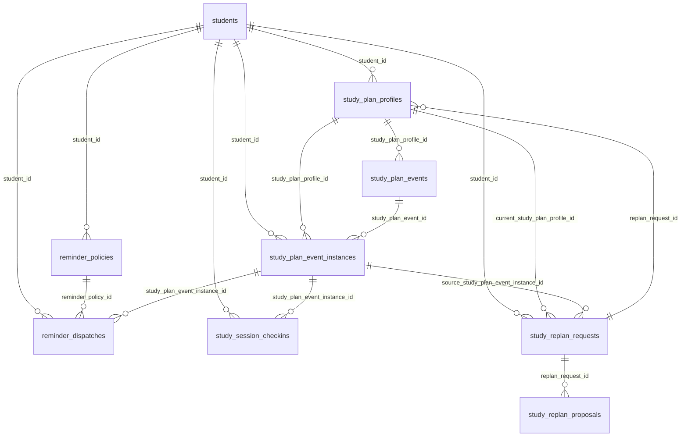

# Plan Tecnico De Migraciones Y Tareas Para Persistencia De Recordatorios, Seguimiento Y Replanificacion

Fecha: 2026-04-03

## 1. Objetivo

Convertir el diagnostico de base de datos y persistencia en una ruta de ejecucion concreta para cubrir de forma persistente:

- recordatorios;
- seguimiento de sesiones de estudio;
- replanificacion automatica y manual.

La propuesta asume el estado actual del proyecto:

- `students`, `schedule_*`, `study_personalization_*`, `study_priority_*` y `study_plan_*` ya existen;
- el patron tecnico vigente es `node -> service -> repository -> psycopg -> SQL`;
- el plan semanal actual se guarda como plantilla semanal en `study_plan_profiles` + `study_plan_events`;
- el estado LangGraph ya incluye `reminders` y `replan`, pero hoy no tienen persistencia propia.

## 2. Decision de arquitectura

## 2.1 Decision principal

No conviene meter recordatorios, seguimiento y replanificacion directamente dentro de `study_plan_events`.

La razon es que `study_plan_events` hoy representa una plantilla semanal:

- dia de semana;
- hora inicio;
- hora fin;
- titulo;
- metadata del planner.

Para recordatorios y seguimiento real se necesitan ocurrencias fechadas. Por eso la propuesta se apoya en una nueva capa persistente:

1. `study_plan_profiles` y `study_plan_events`
   Siguen siendo la plantilla versionada.
2. `study_plan_event_instances`
   Pasa a ser la ocurrencia real con fecha concreta.
3. `reminder_*`
   Maneja politicas y despachos.
4. `study_session_checkins`
   Maneja seguimiento y cierre de sesiones.
5. `study_replan_*`
   Maneja solicitud, propuesta y aplicacion de replanificacion.

## 2.2 Regla de versionado

Se conserva la regla actual del proyecto:

- no sobrescribir snapshots historicos;
- versionar planes;
- marcar el anterior como `superseded`;
- materializar nuevas instancias hacia adelante;
- no borrar historial operativo salvo cascada por eliminacion del estudiante.

## 2.3 Alcance MVP propuesto

Para no abrir demasiado el frente tecnico, el MVP persistente se limita a:

- recordatorios de sesiones de estudio;
- seguimiento de completado, omitido o perdido;
- replanificacion por:
  - solicitud manual del usuario;
  - sesion perdida;
  - cambio del horario base;
  - conflicto detectado.

Se excluye de esta fase:

- integracion real de envio con WhatsApp o Outlook;
- tareas academicas con deadline;
- notas de clase o archivos adjuntos;
- analitica avanzada o dashboards.

## 3. Modelo objetivo resumido

## 4. Migraciones propuestas

## 4.1 `0009_study_plan_instances_and_tracking.sql`

Objetivo:

- crear la capa de ocurrencias reales del plan;
- dejar persistencia minima para seguimiento;
- preparar trazabilidad de planes replanificados.

### 4.1.1 Cambios sobre tablas existentes

Alterar `study_plan_profiles` agregando:

- `origin_type TEXT NOT NULL DEFAULT 'initial'`
  - valores: `initial`, `replan`, `manual_adjustment`, `system_refresh`
- `supersedes_study_plan_profile_id BIGINT NULL REFERENCES study_plan_profiles(id) ON DELETE SET NULL`
  - permite rastrear que plan reemplaza a cual

Indices recomendados:

- `idx_study_plan_profiles_origin_type`
- `idx_study_plan_profiles_supersedes`

### 4.1.2 Nueva tabla `study_plan_event_instances`

Funcion:

- representar sesiones concretas con fecha real;
- ser la fuente de verdad para recordatorios y seguimiento.

Campos propuestos:

| Campo | Tipo | Null | Funcion |
|---|---|---|---|
| id | bigserial | NO | PK tecnica. |
| student_id | bigint | NO | FK a `students`. |
| study_plan_profile_id | bigint | NO | FK al snapshot del plan que genero la instancia. |
| study_plan_event_id | bigint | YES | FK a la plantilla origen. Puede ser `NULL` si la instancia fue creada por replan puntual. |
| source_instance_key | text | NO | Identificador estable de la ocurrencia. |
| planned_date | date | NO | Fecha del evento materializado. |
| starts_at | timestamptz | NO | Inicio real de la sesion. |
| ends_at | timestamptz | NO | Fin real de la sesion. |
| timezone | text | NO | Zona horaria. |
| status | text | NO | Estado operativo de la instancia. |
| source | text | NO | Origen: `materialized_plan`, `replan`, `manual_adjustment`. |
| completion_pct | smallint | YES | Porcentaje de completado 0-100. |
| completed_at | timestamptz | YES | Fecha real de cierre si se completo. |
| instance_payload | jsonb | NO | Payload completo de la instancia. |
| created_at | timestamptz | NO | Fecha de creacion. |
| updated_at | timestamptz | NO | Fecha de actualizacion. |

Checks recomendados:

- `starts_at < ends_at`
- `status IN ('scheduled', 'in_progress', 'completed', 'skipped', 'missed', 'canceled', 'superseded')`
- `completion_pct IS NULL OR completion_pct BETWEEN 0 AND 100`

Constraints e indices recomendados:

- `UNIQUE (source_instance_key)`
- indice por `student_id, planned_date`
- indice por `status, starts_at`
- indice por `study_plan_profile_id`
- indice por `study_plan_event_id`

### 4.1.3 Nueva tabla `study_session_checkins`

Funcion:

- guardar el historial de seguimiento de una instancia;
- dejar auditoria de confirmacion, omision, feedback y cierre.

Campos propuestos:

| Campo | Tipo | Null | Funcion |
|---|---|---|---|
| id | bigserial | NO | PK tecnica. |
| student_id | bigint | NO | FK a `students`. |
| study_plan_event_instance_id | bigint | NO | FK a `study_plan_event_instances`. |
| checkin_type | text | NO | Tipo de checkin. |
| actor_type | text | NO | Quien reporta: `student`, `agent`, `system`. |
| reported_at | timestamptz | NO | Fecha del registro. |
| actual_start_at | timestamptz | YES | Inicio real, si aplica. |
| actual_end_at | timestamptz | YES | Fin real, si aplica. |
| completion_pct | smallint | YES | Avance informado. |
| comprehension_score | smallint | YES | Autopercepcion 1-5. |
| energy_score | smallint | YES | Energia percibida 1-5. |
| notes | text | YES | Nota libre corta. |
| checkin_payload | jsonb | NO | Payload flexible del seguimiento. |
| created_at | timestamptz | NO | Fecha de creacion. |

Valores recomendados para `checkin_type`:

- `start`
- `complete`
- `skip`
- `missed_confirmation`
- `feedback`

Indices recomendados:

- `idx_study_session_checkins_instance_reported_at`
- `idx_study_session_checkins_student_reported_at`

## 4.2 `0010_reminder_policies_and_dispatches.sql`

Objetivo:

- persistir politicas de recordatorio por estudiante;
- tener una cola durable de recordatorios pendientes, enviados, fallidos o reconocidos.

### 4.2.1 Nueva tabla `reminder_policies`

Funcion:

- almacenar la configuracion de recordatorios sin depender del estado LangGraph.

Campos propuestos:

| Campo | Tipo | Null | Funcion |
|---|---|---|---|
| id | bigserial | NO | PK tecnica. |
| student_id | bigint | NO | FK a `students`. |
| channel | text | NO | Canal: `in_app`, `email`, `whatsapp`. |
| reminder_type | text | NO | Tipo de politica. |
| lead_minutes | integer | NO | Anticipacion del recordatorio. |
| followup_minutes | integer | YES | Demora para seguimiento posterior. |
| quiet_hours | jsonb | NO | Ventana silenciosa por zona horaria. |
| enabled | boolean | NO | Si la politica esta activa. |
| timezone | text | NO | Zona horaria del usuario. |
| metadata_json | jsonb | NO | Metadata adicional. |
| created_at | timestamptz | NO | Fecha de creacion. |
| updated_at | timestamptz | NO | Fecha de actualizacion. |

Valores recomendados para `reminder_type`:

- `pre_session`
- `followup`
- `missed_session`

Constraints e indices:

- `lead_minutes >= 0`
- `followup_minutes IS NULL OR followup_minutes >= 0`
- `UNIQUE (student_id, channel, reminder_type, lead_minutes)`
- indice por `student_id, enabled`

### 4.2.2 Nueva tabla `reminder_dispatches`

Funcion:

- almacenar cada envio o intento de envio;
- ser la cola durable para workers o cronjobs futuros.

Campos propuestos:

| Campo | Tipo | Null | Funcion |
|---|---|---|---|
| id | bigserial | NO | PK tecnica. |
| student_id | bigint | NO | FK a `students`. |
| reminder_policy_id | bigint | YES | FK a `reminder_policies`. |
| study_plan_event_instance_id | bigint | YES | FK a `study_plan_event_instances`. |
| dispatch_type | text | NO | Tipo de despacho. |
| channel | text | NO | Canal de envio. |
| scheduled_for | timestamptz | NO | Momento programado de envio. |
| leased_at | timestamptz | YES | Marca para evitar doble procesamiento por worker. |
| sent_at | timestamptz | YES | Fecha real de envio. |
| acknowledged_at | timestamptz | YES | Fecha en que el usuario reconoce el recordatorio. |
| status | text | NO | Estado del despacho. |
| provider_message_id | text | YES | ID devuelto por canal externo si existe. |
| failure_reason | text | YES | Motivo del fallo. |
| payload | jsonb | NO | Payload para render o envio. |
| created_at | timestamptz | NO | Fecha de creacion. |
| updated_at | timestamptz | NO | Fecha de actualizacion. |

Valores recomendados para `status`:

- `pending`
- `leased`
- `sent`
- `failed`
- `canceled`
- `acknowledged`
- `expired`

Indices recomendados:

- `idx_reminder_dispatches_status_scheduled_for`
- `idx_reminder_dispatches_instance`
- `idx_reminder_dispatches_student_created_at`
- `UNIQUE (reminder_policy_id, study_plan_event_instance_id, dispatch_type, scheduled_for)`

## 4.3 `0011_replan_requests_and_proposals.sql`

Objetivo:

- persistir detonantes de replanificacion;
- guardar propuestas generadas;
- enlazar el resultado aplicado con un nuevo `study_plan_profile`.

### 4.3.1 Cambios sobre tablas existentes

Alterar `study_plan_profiles` agregando:

- `replan_request_id BIGINT NULL REFERENCES study_replan_requests(id) ON DELETE SET NULL`

Nota:

- el plan inicial quedaria con `replan_request_id = NULL`;
- un plan generado por replan quedaria con `origin_type = 'replan'` y `replan_request_id` apuntando a la solicitud.

### 4.3.2 Nueva tabla `study_replan_requests`

Funcion:

- registrar cada solicitud o trigger de replanificacion.

Campos propuestos:

| Campo | Tipo | Null | Funcion |
|---|---|---|---|
| id | bigserial | NO | PK tecnica. |
| student_id | bigint | NO | FK a `students`. |
| current_study_plan_profile_id | bigint | NO | FK al plan actual al momento del request. |
| source_study_plan_event_instance_id | bigint | YES | Instancia puntual que disparo la replanificacion. |
| trigger_type | text | NO | Motivo disparador. |
| status | text | NO | Estado del request. |
| reason_text | text | YES | Explicacion humana corta. |
| request_payload | jsonb | NO | Payload completo del request o trigger. |
| resolved_at | timestamptz | YES | Momento de cierre del request. |
| created_at | timestamptz | NO | Fecha de creacion. |
| updated_at | timestamptz | NO | Fecha de actualizacion. |

Valores recomendados para `trigger_type`:

- `user_request`
- `missed_session`
- `schedule_change`
- `calendar_conflict`
- `overload`
- `manual_review`

Valores recomendados para `status`:

- `pending`
- `processing`
- `proposed`
- `accepted`
- `rejected`
- `applied`
- `failed`
- `canceled`

Indices recomendados:

- `idx_study_replan_requests_student_created_at`
- `idx_study_replan_requests_status`
- `idx_study_replan_requests_source_instance`

### 4.3.3 Nueva tabla `study_replan_proposals`

Funcion:

- guardar cada alternativa generada por el motor de replanificacion;
- no sustituye el plan oficial hasta que una propuesta se acepta y se materializa.

Campos propuestos:

| Campo | Tipo | Null | Funcion |
|---|---|---|---|
| id | bigserial | NO | PK tecnica. |
| replan_request_id | bigint | NO | FK al request origen. |
| proposal_number | smallint | NO | Orden de la propuesta dentro del request. |
| status | text | NO | Estado de la propuesta. |
| summary_text | text | YES | Resumen legible para el usuario o auditoria. |
| proposal_payload | jsonb | NO | Payload completo de la propuesta. |
| impact_payload | jsonb | NO | Cambios, costo y efectos esperados. |
| resulting_study_plan_profile_id | bigint | YES | FK al plan creado si la propuesta se aplica. |
| created_at | timestamptz | NO | Fecha de creacion. |
| updated_at | timestamptz | NO | Fecha de actualizacion. |

Valores recomendados para `status`:

- `generated`
- `selected`
- `discarded`
- `applied`

Constraints e indices:

- `UNIQUE (replan_request_id, proposal_number)`
- `idx_study_replan_proposals_request_status`

## 4.4 `0012_grant_operational_persistence_permissions.sql`

Objetivo:

- extender permisos a las tablas nuevas siguiendo el patron de `0005` y `0008`.

Debe otorgar:

- `SELECT, INSERT, UPDATE, DELETE` sobre tablas nuevas;
- `USAGE, SELECT, UPDATE` sobre secuencias nuevas;
- `ALTER DEFAULT PRIVILEGES` alineado con el esquema actual.

## 5. Orden recomendado de implementacion

## Fase 0 - Definiciones funcionales bloqueantes

Antes de escribir migraciones, cerrar estas decisiones:

1. horizonte de materializacion inicial
   - recomendado: 14 dias
2. canales MVP de recordatorio
   - recomendado: `in_app` y `email`
3. reglas por defecto de recordatorio
   - recomendado:
     - `pre_session`: 60 min y 10 min
     - `followup`: 15 min
     - `missed_session`: 30 min
4. politica para marcar una sesion como `missed`
   - recomendado: si `ends_at + 30 min` y no hubo `complete` ni `skip`
5. triggers iniciales de replanificacion
   - recomendado:
     - manual del usuario
     - missed session
     - cambio del horario

Sin estas decisiones, el esquema puede construirse, pero no el comportamiento operativo.

## Fase 1 - Migraciones SQL

Entregables:

- `0009_study_plan_instances_and_tracking.sql`
- `0010_reminder_policies_and_dispatches.sql`
- `0011_replan_requests_and_proposals.sql`
- `0012_grant_operational_persistence_permissions.sql`

Tareas:

- crear tablas, checks, FKs, indices y triggers `updated_at`;
- validar consistencia con esquema ya desplegado;
- ejecutar las migraciones sobre un entorno local;
- actualizar scripts de diagnostico para inspeccionar tablas nuevas.

Criterio de aceptacion:

- migraciones aplican limpias sobre base vacia y sobre base actual;
- `psql` puede consultar todas las tablas nuevas;
- no se rompe el esquema existente.

## Fase 2 - Materializacion persistente de instancias

Objetivo:

- convertir el plan semanal versionado en ocurrencias concretas para los proximos N dias.

Archivos propuestos:

- `src/agents/support/planning/materialization_service.py`
- `src/agents/support/planning/instances_repository.py`
- `src/agents/support/planning/instance_state_helpers.py`

Cambios esperados:

- extender `tools/db.py` con una factoria o servicio para instancias;
- crear un repositorio PostgreSQL para:
  - insertar instancias;
  - superseder instancias futuras del plan anterior;
  - consultar instancias activas por fecha;
- disparar materializacion despues de:
  - `persist_study_profile` cuando queda un plan inicial;
  - `build_study_plan` cuando se recalcula el plan;
  - futura aplicacion de replanificacion.

Regla de negocio recomendada:

- si un nuevo `study_plan_profile` queda `is_current = TRUE`, las instancias futuras del plan anterior pasan a `status = 'superseded'`, no se borran.

Tareas:

1. crear repositorio de instancias;
2. crear servicio de materializacion;
3. integrar el servicio al flujo de planning persistente;
4. agregar script de backfill para planes actuales.

Script propuesto:

- `scripts/backfill_study_plan_instances.py`

Pruebas:

- `tests/test_study_plan_instances_persistence.py`
- `tests/test_study_plan_materialization_service.py`

Criterio de aceptacion:

- al guardar un plan actual se crean instancias para el horizonte definido;
- si se guarda un nuevo plan, las futuras del anterior quedan `superseded`;
- las instancias pasadas no se alteran.

## Fase 3 - Persistencia de recordatorios

Objetivo:

- almacenar politicas y despachos sin depender del estado del thread.

Archivos propuestos:

- `src/agents/support/reminders/repository.py`
- `src/agents/support/reminders/service.py`
- `src/agents/support/reminders/dispatcher.py`
- `src/agents/support/reminders/state_helpers.py`

Cambios esperados:

- extender `RemindersState` con:
  - `persisted_policy_ids`
  - `last_dispatch_error`
  - `last_sync_at`
- agregar `get_reminders_service()` a `tools/db.py`;
- generar politicas default al primer plan persistido o en un paso explicito de configuracion;
- generar `reminder_dispatches` a partir de `study_plan_event_instances`;
- crear un worker o script idempotente para despachar pendientes.

Script/worker propuesto:

- `scripts/run_due_reminders.py`

Consultas criticas del worker:

- tomar `reminder_dispatches` con `status = 'pending'` y `scheduled_for <= now()`;
- marcar `leased`;
- intentar envio;
- marcar `sent` o `failed`.

Pruebas:

- `tests/test_reminder_policy_persistence.py`
- `tests/test_reminder_dispatch_service.py`
- `tests/test_due_reminder_runner.py`

Criterio de aceptacion:

- cada instancia futura puede generar recordatorios persistidos;
- se puede diferenciar `pending`, `sent`, `failed`, `acknowledged`;
- reintentos no duplican recordatorios por constraint unica.

## Fase 4 - Persistencia de seguimiento

Objetivo:

- registrar el ciclo de vida real de cada sesion.

Archivos propuestos:

- `src/agents/support/planning/tracking_repository.py`
- `src/agents/support/planning/tracking_service.py`
- `src/agents/support/planning/tracking_state_helpers.py`

Cambios esperados:

- agregar operaciones para:
  - iniciar sesion
  - completar sesion
  - omitir sesion
  - marcar perdida
  - enviar feedback
- insertar fila en `study_session_checkins`;
- actualizar `study_plan_event_instances.status`, `completion_pct` y `completed_at`.

Decision recomendada:

- `study_plan_event_instances` guarda el estado actual consolidado;
- `study_session_checkins` guarda la historia de eventos.

Integracion de flujo sugerida:

- no es obligatorio abrir un subgrafo nuevo en la primera entrega;
- puedes empezar con funciones de dominio + endpoints o scripts internos;
- luego conectar al agente conversacional.

Scripts propuestos:

- `scripts/mark_missed_sessions.py`
- `scripts/record_session_completion.py`

Pruebas:

- `tests/test_study_session_tracking_service.py`
- `tests/test_mark_missed_sessions.py`

Criterio de aceptacion:

- una instancia puede terminar en `completed`, `skipped` o `missed`;
- toda transicion deja un checkin persistido;
- las metricas de completado sobreviven al reinicio del hilo.

## Fase 5 - Replanificacion persistente

Objetivo:

- guardar la causa, propuestas y resultado de una replanificacion.

Archivos propuestos:

- `src/agents/support/replan/repository.py`
- `src/agents/support/replan/service.py`
- `src/agents/support/replan/state_helpers.py`
- `src/agents/support/replan/proposal_builder.py`

Cambios esperados:

- extender `ReplanState` con:
  - `persisted_request_id`
  - `persisted_proposal_id`
  - `last_replan_error`
- crear servicio que:
  - abra `study_replan_requests`;
  - genere una o varias `study_replan_proposals`;
  - permita seleccionar una propuesta;
  - materialice un nuevo `study_plan_profile`;
  - relacione el nuevo plan con `replan_request_id` y `supersedes_study_plan_profile_id`.

Flujo de aplicacion recomendado:

1. crear `study_replan_request`
2. guardar una o mas propuestas
3. seleccionar propuesta
4. crear nuevo `study_plan_profile`
5. crear nuevos `study_plan_events`
6. materializar nuevas `study_plan_event_instances`
7. marcar instancias futuras del plan anterior como `superseded`
8. cancelar recordatorios pendientes del plan anterior
9. generar recordatorios del nuevo plan

Triggers MVP recomendados:

- `user_request`
- `missed_session`
- `schedule_change`

Pruebas:

- `tests/test_replan_request_persistence.py`
- `tests/test_replan_apply_creates_new_plan_version.py`
- `tests/test_replan_cancels_old_reminders.py`

Criterio de aceptacion:

- cada replanificacion deja request y propuestas persistidas;
- al aceptar una propuesta se crea un nuevo plan versionado;
- el enlace historico entre planes queda trazable.

## 6. Tareas concretas por archivo o modulo

## 6.1 Migraciones

- crear `migrations/0009_study_plan_instances_and_tracking.sql`
- crear `migrations/0010_reminder_policies_and_dispatches.sql`
- crear `migrations/0011_replan_requests_and_proposals.sql`
- crear `migrations/0012_grant_operational_persistence_permissions.sql`

## 6.2 Factorias y configuracion

- actualizar `src/agents/support/tools/db.py`
  - agregar getters/setters para reminders, tracking y replan
- revisar si `src/agents/support/tools/db_config.py` necesita cambios
  - probablemente no

## 6.3 Estado del agente

- actualizar `src/agents/support/state.py`
  - extender `RemindersState`
  - extender `ReplanState`
  - evaluar si agregar un subestado minimo para tracking

Recomendacion:

- no crear un top-level `tracking` si no es estrictamente necesario;
- dejar tracking como dominio persistente derivado de instancias y checkins.

## 6.4 Planning

- crear `src/agents/support/planning/materialization_service.py`
- crear `src/agents/support/planning/instances_repository.py`
- crear `src/agents/support/planning/tracking_repository.py`
- crear `src/agents/support/planning/tracking_service.py`

## 6.5 Reminders

- crear `src/agents/support/reminders/__init__.py`
- crear `src/agents/support/reminders/repository.py`
- crear `src/agents/support/reminders/service.py`
- crear `src/agents/support/reminders/dispatcher.py`

## 6.6 Replan

- crear `src/agents/support/replan/__init__.py`
- crear `src/agents/support/replan/repository.py`
- crear `src/agents/support/replan/service.py`
- crear `src/agents/support/replan/proposal_builder.py`

## 6.7 Integracion con nodos

Cambios iniciales recomendados:

- `src/agents/support/nodes/persist_study_profile/node.py`
  - materializar instancias al crear plan inicial
- `src/agents/support/nodes/build_study_plan/node.py`
  - materializar instancias al recalcular plan
- `src/agents/support/planning/persistence_support.py`
  - integrar hooks para materializacion post persistencia

Cambios posteriores:

- crear nodos especificos para checkin y replan cuando el producto los necesite conversacionalmente

## 6.8 Scripts operativos

- `scripts/backfill_study_plan_instances.py`
- `scripts/run_due_reminders.py`
- `scripts/mark_missed_sessions.py`
- `scripts/replan_from_missed_session.py`

## 6.9 Observabilidad y diagnostico

Extender `migrations/diagnostics/` con:

- `check_study_plan_instances.sql`
- `check_reminder_dispatches.sql`
- `check_replan_requests.sql`
- `check_tracking_summary.sql`

## 7. Riesgos y mitigaciones

## 7.1 Riesgo: duplicacion de recordatorios

Mitigacion:

- constraint unica en `reminder_dispatches`;
- lease explicito para workers;
- diseno idempotente del dispatcher.

## 7.2 Riesgo: borrar historia por sobrescribir planes

Mitigacion:

- mantener versionado;
- no borrar instancias ni checkins;
- marcar `superseded` en lugar de eliminar.

## 7.3 Riesgo: complejidad excesiva de replanificacion

Mitigacion:

- empezar con pocos triggers;
- persistir propuestas en JSONB;
- materializar un nuevo plan oficial solo cuando se acepta una propuesta.

## 7.4 Riesgo: worker sin canal real de envio

Mitigacion:

- en MVP, empezar con `in_app` y `email`;
- si el canal externo no existe, aun asi la cola y el historial deben persistirse.

## 8. Priorizacion recomendada

Orden recomendado de entrega:

1. `study_plan_event_instances`
2. `study_session_checkins`
3. `reminder_policies`
4. `reminder_dispatches`
5. `study_replan_requests`
6. `study_replan_proposals`
7. integracion conversacional del replan

Razon:

- sin instancias fechadas no existe base real para recordatorios ni seguimiento;
- sin seguimiento no existe buen trigger persistente para replanificacion;
- replanificacion debe construirse sobre esas dos capas.

## 9. Entrega minima defendible

Si hubiera que recortar para una primera entrega fuerte, recomiendo este corte:

### MVP Persistente V1

- `0009` y `0010`
- materializacion de instancias
- recordatorios persistidos
- checkins y estados `completed`, `skipped`, `missed`

### MVP Persistente V2

- `0011` y `0012`
- requests y propuestas de replanificacion
- aplicacion de propuesta a nuevo plan versionado

## 10. Veredicto final

La ruta mas segura no es agregar tablas sueltas alrededor del estado actual, sino introducir una capa operativa persistente sobre el plan:

- primero instancias;
- luego recordatorios y seguimiento;
- despues replanificacion.

Ese orden respeta el diseno actual del proyecto y mantiene la fuente de verdad en PostgreSQL sin pelearse con LangGraph.
